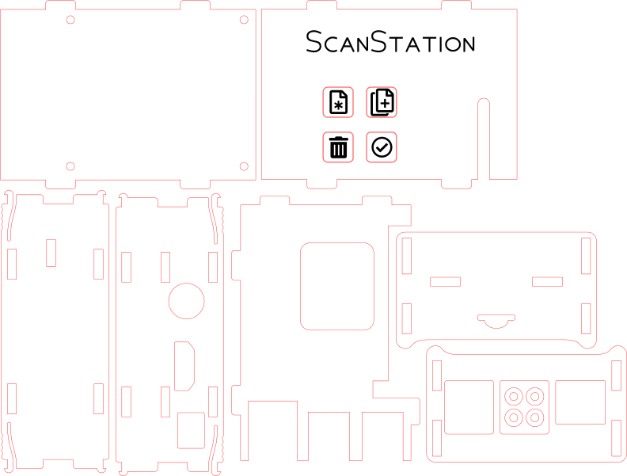
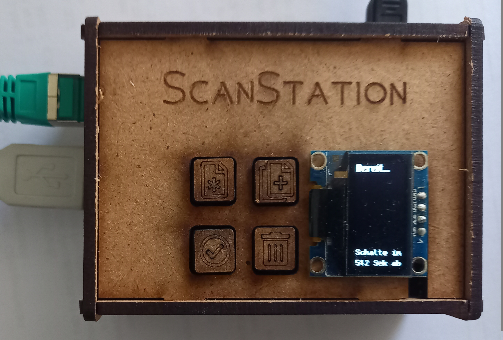

Raspberry Pi Hardware
=====================

Mit Lötkolben und Lochplatine bewaffnet kann man (ohne größere Fähigkeiten) einen HAT für den Raspberry Pi basteln, für die Verkabelung der Tasten bieten sich
 * *GPIO5* (Pin 29)
 * *GPIO13* (Pin 33)
 * *GPIO19* (Pin 35)
 * *GPIO26* (Pin 37)
 * sowie *GND* auf Pin 25 und 39 an

Das [SSD1306](https://cdn-shop.adafruit.com/datasheets/SSD1306.pdf)-Display wird über [I²C](https://de.wikipedia.org/wiki/I%C2%B2C) angesteuert und sollte daher
 * *GPIO2* (Pin 3) für Datenleitung (SDA)
 * *GPIO3* (Pin 5) für Taktleitung (SCL) sowie
 * *3V3* (Pin 1) für Versorgungsspannung (VCC) und
 * *GND* auf Pin 6 oder 9 für die Masse

Die Position der Taster sollte natürlich zum Gehäuse passen.

Ein Beispielplan für ein 3mm-[HDF](https://de.wikipedia.org/wiki/Harte_Faserplatte)-Gehäuse mittes Lasercutter (zu finden im nächsten Maker-Space oder [FabLab](https://de.wikipedia.org/wiki/FabLab)):

Es bietet sich ggf. an die Tasten selbst aus dickeren (5mm) Platten zu lasern:

