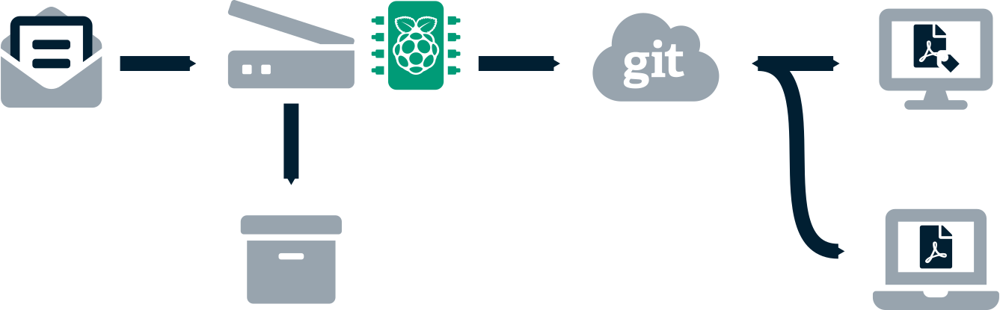
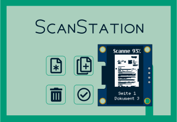
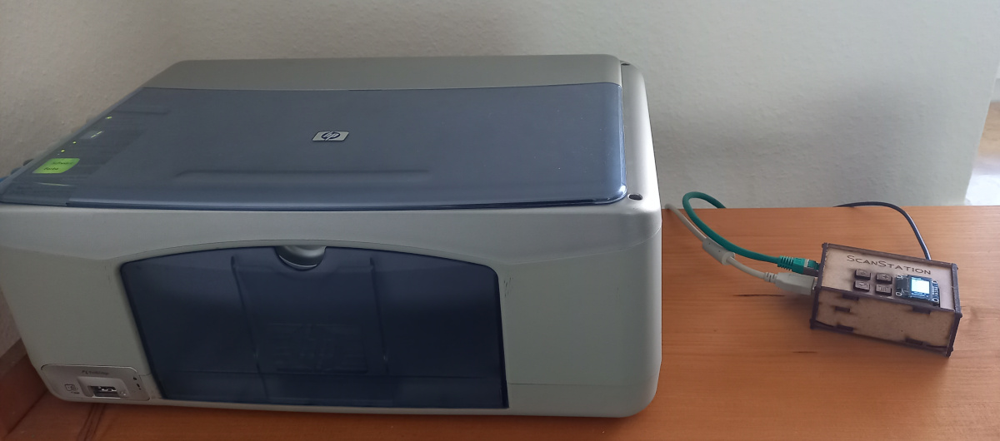
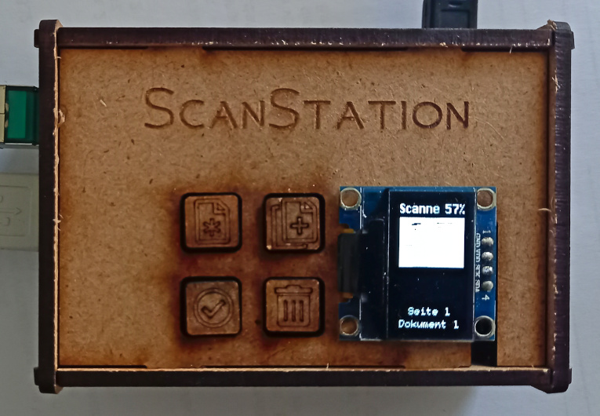

ScanStation
===========

Nach einem langen Arbeitstag zu Hause angekommen, gibt es nur bedingt Motivation neue, archivierungsrelevante Briefe in den entsprechenden Ordner einzusortieren.
Wenn dann die Zeit da ist sich um diese Dokumente mal zu kümmern, sind diese oftmals nicht direkt greifbar.
Und wenn dann mal ein konkreter Brief gesucht wird, ist das selbst bei ordentlicher Sortierung eine umständliche Arbeit.

Abhilfe würde eine einfache und bequeme Digitalisierung schaffen, während die Originaldokumente dann (somit auch automatisch chronologisch geordnet) in eine Archivbox wandern.

Da der Start eines üblichen Heim-PCs zum digitalisieren jedoch nicht zwingend *bequem* ist, wird hier eine andere Lösung präferiert, welche autonom arbeitet.

Außerdem soll hierfür primär alte oder zumindest günstige Hardware zum Einsatz kommen:
Ein alter Scanner (bzw. Multifunktionsdrucker) findet sich noch in vielen Haushalten, die Steuerung übernimmt ein [Raspberry Pi](https://de.wikipedia.org/wiki/Raspberry_Pi), welcher lediglich über ein paar Taster und eine kleine OLED Anzeige (Kostenpunkt Peripherie: etwa 5 Euro) gesteuert werden kann.

Und selbstverständlich soll nur freie Software eingesetzt werden (sofern möglich, potenzielle Ausnahme: proprietäre Scannertreiber ohne freie Alternativen).

Ablauf
------

Die neu eingegangenen Papier-Dokumente werden über einen an die **ScanStation** angeschlossenen Scanner durch einen einzigen Tastendruck digitalisiert, komprimiert, eine Texterkennung durchgeführt und mittels Versionsverwaltung digital archiviert.

Das Originaldokument kommt nach dem [FIFO-Verfahren](https://de.wikipedia.org/wiki/First_In_%E2%80%93_First_Out) in eine Archivbox, je nach Postaufkommen wird im Monats-, Quartals- oder Jahrestakt entweder ein Trennblatt eingefügt oder die volle Box beschriftet, auf den Dachboden verfrachtet und durch eine neue, leere Box beim Scanner ersetzt.

Durch die verteilte Versionsverwaltung [git](https://de.wikipedia.org/wiki/Git) können die Dokumente von beliebigen berechtigten Systemen gelesen werden.
Obwohl für den Zugriff aufgrund der einfachen Ordnerstruktur (Name entspricht dem Datum) und der Archivierung als [PDF](https://de.wikipedia.org/wiki/Portable_Document_Format) nur die übliche Standardsoftware benötigt wird, ist das erstellte Ordner- und Dateiformat für die Software [Paperwork](https://openpaper.work/) (für Linux & Windows) optimiert:
Sie bietet über eine grafische Oberfläche (aber auch via Kommandozeileneingabe) eine chronologisch geordnete Übersicht aller Dokumenteneingänge, eine einfache Suche über die per Texterkennung extrahierten Inhalte sowie die Möglichkeit die Dokumente mittels Annotierungen weiter einzuordnen -- diese können (und sollen) natürlich wieder in das Versionsverwaltungssystem übertragen werden.

Bedienung
---------

Die gesamte Benutzerschnittstelle besteht aus vier Tasten und einem kleinen, niedrig auflösenden Monochromdisplay.

Die durch kleine Piktogramme bebilderten Funktionen der Tasten sind:
 * ein neues Dokument (Seite 1) scannen 
 * eine weitere Seite zum aktuellen Dokument hinzufügen
 * die zuletzt gescannte Seite im Speicher löschen (Stack-Prinzip)
 * fertig / Komprimierung, Texterkennung und Synchronisierung (in das entfernte Versionsverwaltungssystem) starten

Das Display zeigt den aktuellen Zustand des Systems und während des Scans den aktuellen Fortschritt (mit Miniaturvorschau) an.

Aufbau
------

Es werden folgende Hardwarekomponenten benötigt:

 * [SANE-kompatibler](http://www.sane-project.org/sane-supported-devices.html) USB-Scanner
 * Rasperry Pi (2/3/4)
 * 4 Taster
 * monochromes I²C OLED Display ([SSD1306](https://cdn-shop.adafruit.com/datasheets/SSD1306.pdf))
 * *optional:* Speicherplatz auf Server für Dokumentenarchiv
 * *optional:* Zugriff auf Laser-Cutter sowie ein paar HDF für Gehäuse

Die Verkabelung und der Aufbau wird in der [Bauanleitung](BUILD.md) erklärt.

Dieses Projekt bündelt vor allem vorhandene Lösungen (insbesondere von [OpenPaperwork](https://gitlab.gnome.org/World/OpenPaperwork)) und stellt ein einfaches Benutzerinterface dafür bereit, konkret baut es dabei auf folgender Software auf:

 * dem debianoide [Raspbian](https://www.raspberrypi.org/software/operating-systems/) als Betriebssystem
 * Python 3 mit Grafikbibliotheken ([Pillow](https://pillow.readthedocs.io/en/latest/), [Cairo](https://pycairo.readthedocs.io/en/latest/) usw.)
 * [Sane](http://www.sane-project.org/) Werkzeuge (sowie [Libinsane](https://gitlab.gnome.org/World/OpenPaperwork/libinsane))
 * [JBIG2 Encoder](https://github.com/agl/jbig2enc)
 * sowie [Paperwork](https://openpaper.work/) für die Verwaltung der Dokumente

Weitere Details dazu finden sich in der [Installationsanleitung](INSTALL.md).

Designentscheidungen
--------------------

### Minimalistische Benutzerschnittstelle

Die Verwendung von nur vier Tasten sowie ein kleines Monochromdisplay sorgt nicht nur für eine einfache Bedienung, sondern auch die Entwicklung der Software ist deutlich einfacher (und die Hardware günstiger!) als z. B. mit einem kleinen Touchpad.
Außerdem würde eine solche Toucheingabe schlicht keinen Mehrwert für das System bringen.

### Versionsverwaltungssystem

Da die PDF-Dokumente nur die Bilddateien als Inhalt haben (die Resultate der Texterkennung werden in einer separaten Datei im XML Format gespeichert) und nach der Erstellung nicht mehr bearbeitet werden, kann *git* diese gut verwalten.
Alle Änderungen (wie Annotationen) geschehen nur in zusätzlichen Textdateien, Dateisystemoperationen wie die Umbenennung des Ordners (in Paperwork automatisch bei Änderung des Datums) werden von diesem Versionsverwaltungssystem gut erkannt und nur durch Änderungen der Metadaten gespeichert. Aus Archivierungssicht ist auch eine lückenlose Nachvollziehbarkeit von Änderungen wünschenswert, ohne Möglichkeit diese unerkannt zu modifizieren. Zudem können bequem Spiegelungen des Repositorys erstellt werden.

### JBIG2 Bildformat

Mit dem [JBIG2](https://de.wikipedia.org/wiki/JBIG2)-Format können sehr gute Kompressionsraten erzielt werden: Eine typische Din-A4 Seite braucht bei 600 DPI im Schnitt nur zwischen 25KB und 50KB.

Leider kommt dies mit einigen signifikanten Nachteilen:
Zum einen wird nur Schwarz-Weiß (keine Graustufen!) unterstützt, zum anderen gibt es durch die verlustbehaftete Komprimierung die Gefahr, dass Zeichen *vertauscht* werden (im schlimmsten Fall wird eine *6* zu einer *8*, siehe Vortrag [Traue keinem Scan, den du nicht selbst gefälscht hast](http://www.dkriesel.com/blog/2013/0802_xerox-workcentres_are_switching_written_numbers_when_scanning)).

Wieso dennoch dieses Format verwenden?
 * Die Kompressionsraten von anderen Verfahren, welche nicht an diesem Problem leiden (wie [JPEG 2000](https://de.wikipedia.org/wiki/JPEG_2000)) sind leider deutlich schlechter, was sich auf längere Sicht auch in einem deutlich zu hohen Speicherbedarf niederschlagen wird. Daneben gibt es mit der Texterkennung auch einen weiteren Faktor für Fehler bei der Zeichenerkennung -- weshalb auch die Suchergebnisse mit einer gewissen Skepsis betrachtet werden müssen.
 * Und da eigentlich nur textuelle Dokumente relevant für die Archivierung sind, ist das Fehlen von Farben oder Graustufen in der digitalisierten kein Nachteil.
 * Außerdem können Bilder in diesem Format in PDF-Dateien eingebettet werden, d.h. es ist keine spezielle Software zum Betrachten notwendig.

Schlussendlich sollen diese digitalisierten Dokumente nicht die Originaldokumente ersetzen, sondern nur den Zugriff auf diese vereinfachen: Die digitalen Versionen sind überall verfügbar und können einfach durchsucht werden, bei Bedarf erlauben sie (durch das Datum) einen einfachen Zugriff auf die tatsächlichen Papierdokumente.

Beispiel
--------

Die *ScanStation* im Praxisbetrieb:

Weiterentwicklung & Lizenz
--------------------------

Da die hier präsentierte *ScanStation* erfolgreich im Einsatz ist und die geforderte Funktionalität bietet, darf dieses Projekt als abgeschlossen betrachtet werden -- eine Weiterentwicklung meinerseits ist nicht geplant (zumindest so lange ich keine neue Funktionalität brauche).

Die Skripte und Vorlagen dürfen jedoch gerne weiterverwendet und an die eigenen Bedürfnisse angepasst werden, sie stehen unter der [GNU AGPL v3](LICENSE.md).
